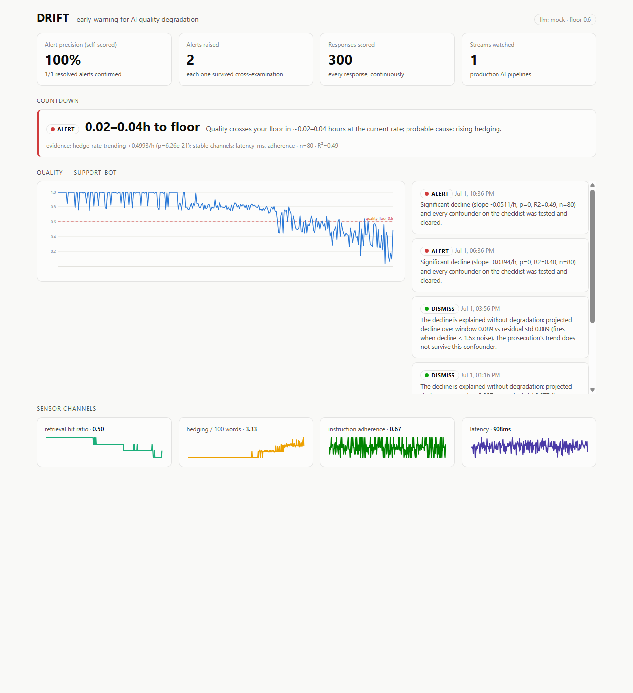

# DRIFT — Early-Warning System for AI Quality Degradation



**Every AI observability tool tells you what your quality *was*. DRIFT tells you
when it will become unacceptable — and whether the alarm is even real.**

DRIFT treats a production AI stream the way predictive maintenance treats a
machine: degradation arrives on a gradient, visible long before the first
undeniable failure. DRIFT watches the gradient, then puts every suspicion on
trial — a **Prosecutor** arguing decay, a **Defense** attacking confounders, a
**Judge** ruling with cited evidence — so the only alerts that reach you are the
ones that survived cross-examination. Then it hands you a **countdown**, not a
dashboard:

> *"Quality crosses your floor in ~3.2–5.5 hours at the current rate; probable
> cause: retrieval decay."* — an actual mock-mode run against a planted
> degradation schedule; the real crossing landed inside the predicted window.

## Design principles

1. **LLMs argue and explain; deterministic code measures and extrapolates.**
   No language model ever produces a number this system acts on. Regression,
   changepoint detection, confounder statistics, and the countdown are all
   deterministic (`scipy`, `ruptures`); the court interprets and phrases.
2. **Uncertainty buys evidence, not silence.** A suspicious-but-unproven trend
   doesn't page a human and doesn't get dismissed — the WATCH verdict tightens
   the sampling rate until the debate can be settled.
3. **The system grades itself.** Every ALERT's outcome is backfilled when the
   predicted crossing does (or doesn't) happen; the dashboard shows the live
   precision score. No competitor shows you their false-alarm rate.

## Quickstart (zero API keys)

Everything runs in **mock mode** out of the box: every LLM seat sits behind an
OpenAI-compatible client abstraction, and the mock backend answers
deterministically by parsing the *same prompts* the live models would see.

```bash
python -m venv .venv && . .venv/bin/activate   # Windows: .venv\Scripts\activate
pip install -e ".[dev]"
pytest                                          # 27 tests incl. the 3 fixture verdicts

# replay the planted-drift stream through the full pipeline
python -m drift.streams.replay tests/fixtures/drift_stream.jsonl --db sqlite:///demo.db

# dashboard
uvicorn drift.dashboard.server:app --port 8000  # (DATABASE_URL=sqlite:///demo.db)
cd dashboard && npm install && npm run build    # then open http://localhost:8000
```

## The three fixture verdicts (the soul of CI)

`tests/test_verdicts.py` replays three synthesized 300-response support-bot
streams and asserts the court's judgment. A green build is a machine-checked
claim, inspectable in the public Actions tab:

| Fixture | What's planted | Required verdict |
|---|---|---|
| `stable_stream.jsonl` | noise only | no ALERT (Defense wins) |
| `drift_stream.jsonl` | retrieval decay on a known schedule | ALERT + countdown, outcome confirmed, cause attributed to retrieval decay |
| `confounder_stream.jsonl` | traffic-mix shift ONLY — hard topics grow from 20%→75%, per-topic quality constant | no ALERT (**the hard case**: aggregate trend is significantly negative; pure changepoint detection convicts; the Defense's within-segment test acquits) |

The drift test goes further: the first countdown's predicted window must
bracket the crossing that actually happens later in the stream, and the alert's
outcome must be backfilled — the prophecy is graded against ground truth
(`tests/fixtures/drift_stream.ground_truth.json`).

## Architecture

```
 production AI stream (live traffic or replay)
        │
        ▼
 SENSOR LAYER (deterministic + LLM-as-judge scorer)
   quality, latency, length, refusal, hedging,
   truncation, retrieval-hit ratio, adherence
        │
        ▼
 DRIFT LEDGER (append-only; sqlite dev / postgres prod)
   one row per response · verdicts stamped ·
   outcomes backfilled → the system grades itself
        │
        ▼
 THE COURT (sampled windows; WATCH tightens sampling)
   PROSECUTOR  fits trends, argues degradation
   DEFENSE     attacks: traffic mix? outlier user?
               time-of-day? scorer noise? sample size?
   JUDGE       DISMISS / WATCH / ALERT, citing ledger rows
        │ ALERT
        ▼
 FORECASTER  countdown.py computes hours-to-floor with a
   confidence range (refuses when R² is too weak — a range
   is honest, a confident number from a bad fit is theater);
   the voice model phrases ONE sentence → webhook + dashboard
```

Module map: `drift/sensor` `drift/ledger` `drift/court` `drift/forecast`
`drift/streams` (generators + replay) `drift/dashboard` + `dashboard/` (SPA).

## Model casting (live mode)

| Seat | Model | Why |
|---|---|---|
| Quality scorer | Qwen3-30B-A3B | rubric-anchored, temp 0 — consistency over brilliance |
| Prosecutor | Qwen3-30B-A3B | argues from statistical tool output; aggressive is safe because the Defense exists |
| Defense | Qwen3-30B-A3B | same weight class — a fair fight |
| Judge | Qwen3-235B-A22B | the seat where judgment failure costs money in both directions |
| Forecaster voice | Qwen3-8B | phrases one sentence; never computes |

**Why AMD:** scoring *every* response continuously plus two extra reasoning
passes per suspicion is exactly the workload per-token API economics punishes —
and flat-cost resident models on an MI300X (192 GB HBM holds scorer + full
court simultaneously) make cheap. Adversarial verification is the feature
incumbents can't afford to build on API economics; our moat is partly a
hardware-cost artifact, and we say so.

## Wiring a real endpoint

```bash
export DRIFT_LLM_MODE=live
export DRIFT_LLM_BASE_URL=https://api.fireworks.ai/inference/v1   # or your vLLM/ROCm endpoint
export DRIFT_LLM_API_KEY=...
```

**First live-mode action (the go/no-go spike):** run the scorer-variance
calibration against the real model —

```bash
python -m drift.sensor.calibrate --mode live --repeats 3
```

It scores a labeled set 3×, reports repeat variance, label agreement, and
tercile separability. If the scorer's noise swamps the drift magnitude, the
build pivots to hard-metric sensing before anything else is invested. (The
committed calibration labels are generation-time stand-ins; replace with real
hand labels for the production spike.)

Deployment: `docker compose up` (app + postgres) — see `deploy.yml` for the
GHCR image; identical pipeline deploys in a customer VPC because the stack is
open end-to-end.

## Status / roadmap

- [x] Sensor, ledger, adversarial court, forecaster, replay — all mock-first, CI green
- [x] Dashboard: countdown banner, debate transcripts, precision panel, sensor sparklines
- [ ] Live Qwen endpoints on AMD Developer Cloud + real-model calibration spike
- [ ] Recorded 4-act demo (green → whisper → verdict → graded prophecy)
- [ ] Customer-discovery quotes (5 outreach messages, per the build plan)
